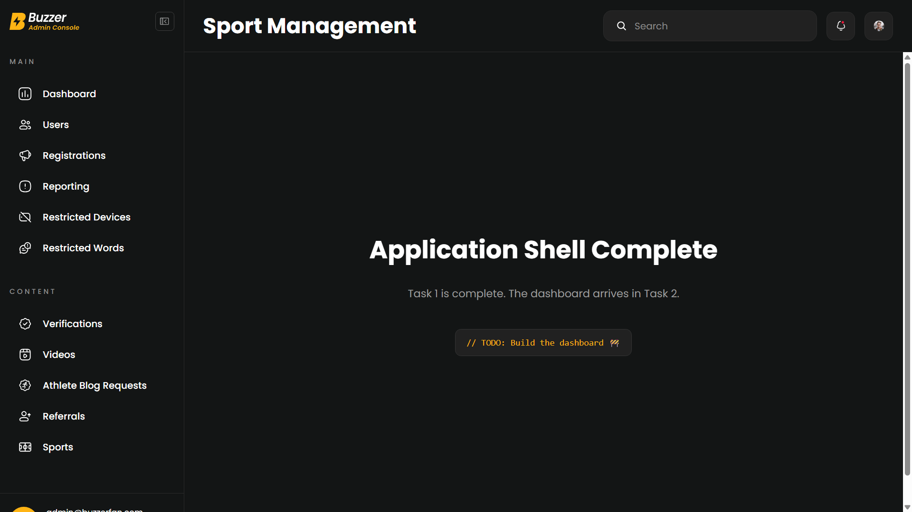
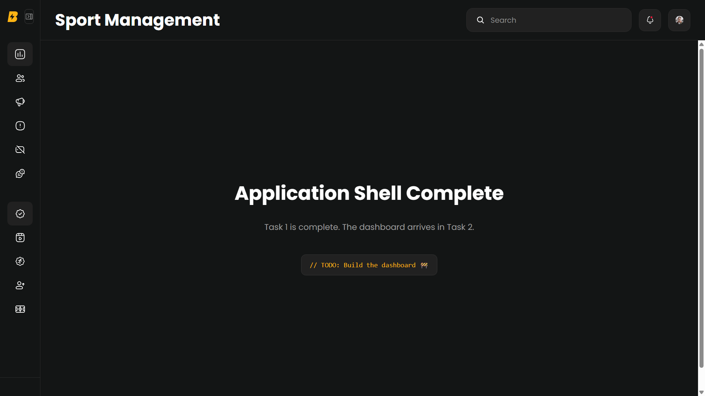

# 🏆 Sports Console

An Angular-based moderation console built as part of the **Buzzer Developer Onboarding** process.

## 🚀 Live Demo

🔗 https://sports-console.vercel.app/

---

## 🛠️ Tech Stack

- Angular (Standalone Components)
- TypeScript
- SCSS
- Angular Router

---

## 📂 Project Structure

```
src
├── app
│   ├── common
│   │   ├── components
│   │   ├── constants
│   │   ├── models
│   │   ├── pipes
│   │   ├── services
│   │   ├── styles
│   │   └── utils
│   │
│   ├── core
│   │   └── layouts
│   │
│   └── features
│
└── assets
```

---

# 📋 Progress

- ✅ Task 1 – Project Initialization & Application Shell
- ⏳ Task 2 – Authentication & Backend Connectivity
- ⏳ Task 3 – Dashboard
- ⏳ More tasks coming...

---

# ✅ Task 1 – Project Initialization & Application Shell

### Completed

- Initialized Angular project using Standalone Components
- Configured SCSS styling
- Built responsive application shell
- Implemented collapsible sidebar
- Implemented application header
- Configured routing structure
- Added dashboard placeholder
- Organized project architecture
- Configured environment files
- Successfully deployed the application on Vercel

---

## 📸 Screenshots

### Application Shell



---

### Project Structure



---

## 🌐 Deployment

The application is deployed on Vercel.

**Live URL**

https://sports-console.vercel.app/

---

## 👨‍💻 Author

**Hardik Gaur**