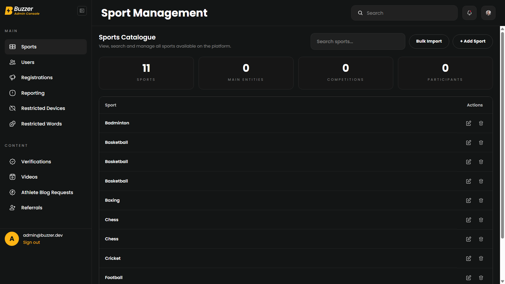
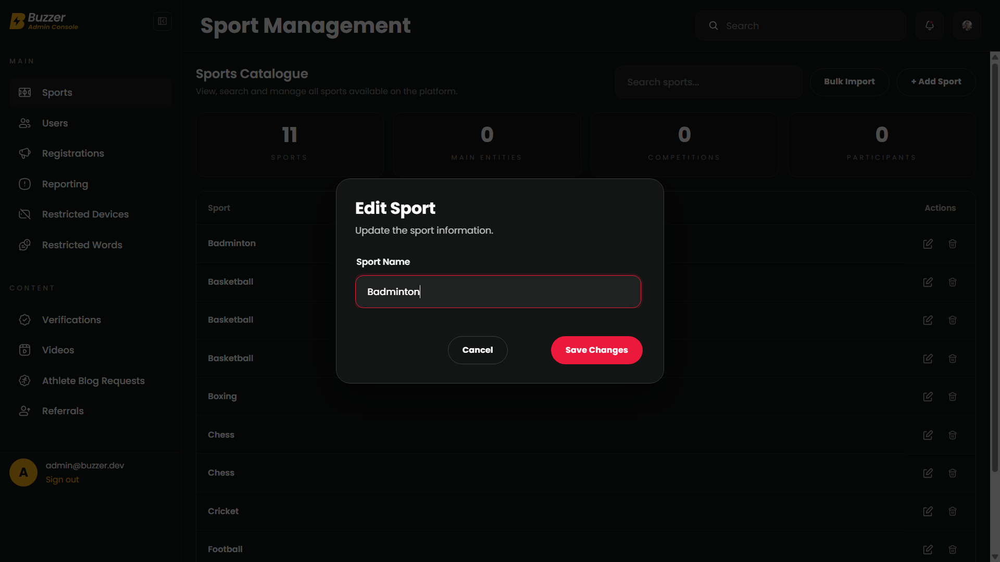
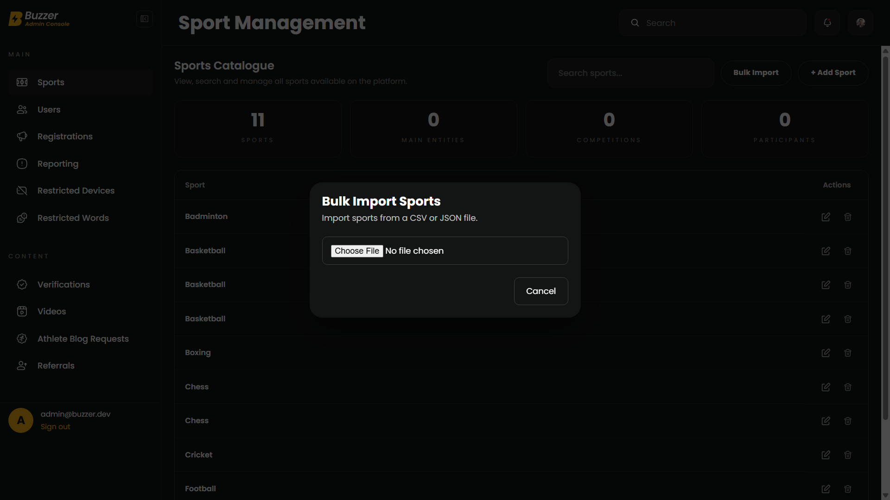
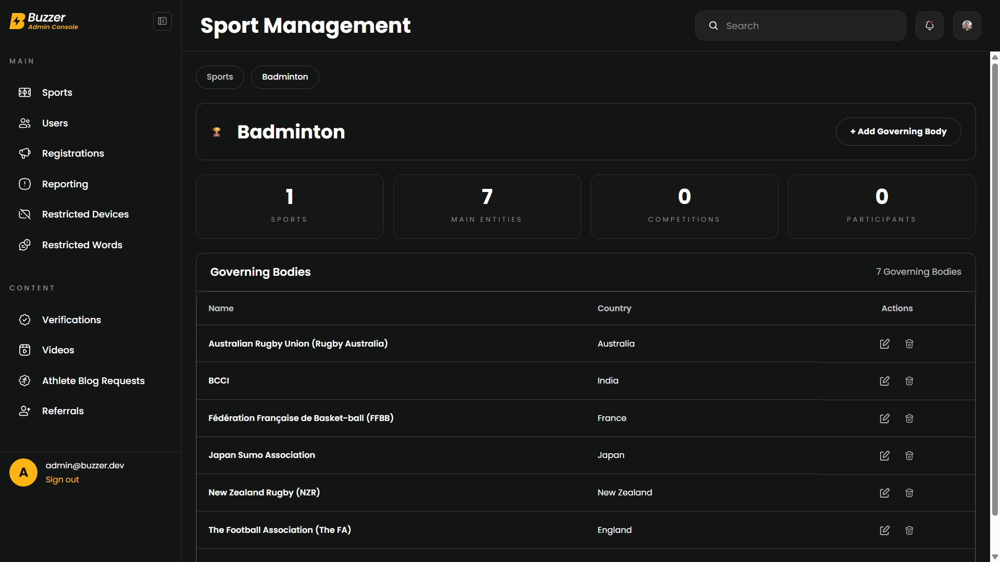
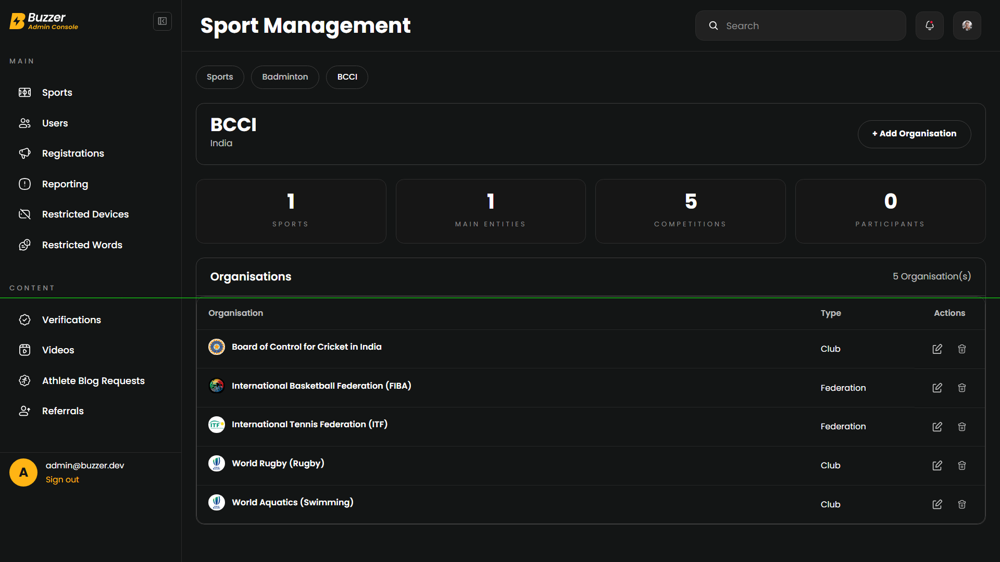
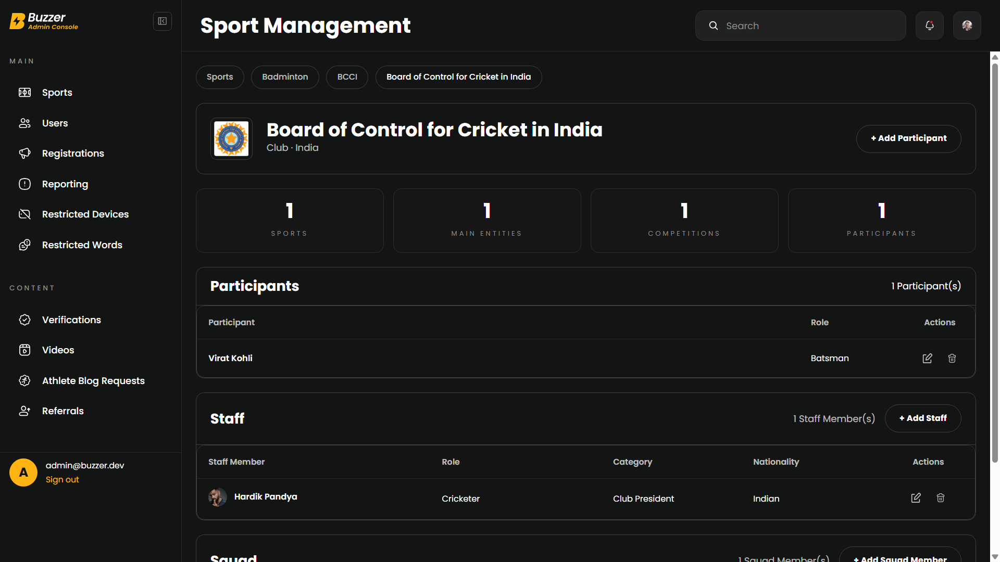
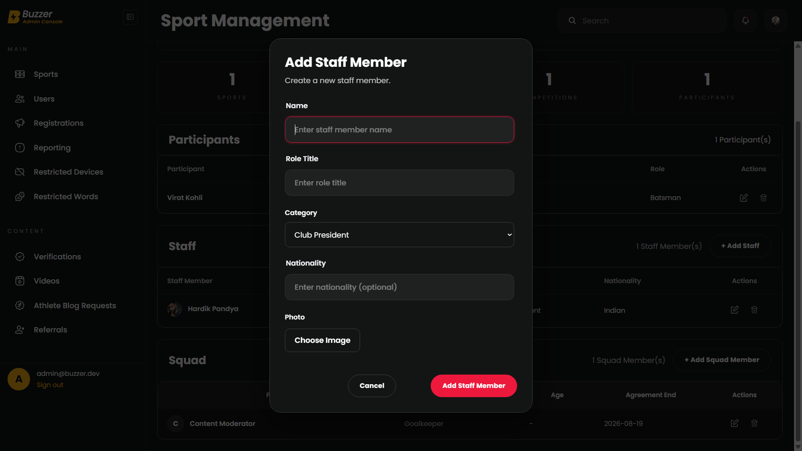

# 🏆 Buzzer Admin Console

A modern Angular-based administration dashboard for managing the complete sports ecosystem including Sports, Governing Bodies, Organisations, Participants, Staff Members and Squads.

Built with a scalable feature-first architecture, reusable UI components, reactive forms, and a responsive dark-themed interface.

---

## 🚀 Live Demo

🔗 https://sports-console.vercel.app/

---

# ✨ Features

### Sports Management

- View all sports
- Add new sports
- Edit existing sports
- Delete sports
- Bulk import (CSV / JSON)

### Governing Bodies

- Create governing bodies
- Edit governing bodies
- Delete governing bodies
- Country information
- Statistics overview

### Organisations

- Create organisations
- Organisation crest upload
- Organisation avatar fallback
- Edit organisations
- Delete organisations

### Participants

- Add participants
- Edit participant information
- Role management

### Staff Management

- Add staff members
- Edit staff members
- Staff photo upload
- Avatar fallback
- Nationality support
- Category management

### Squad Management

- Player management
- Position assignment
- Agreement information
- Avatar fallback

### UI Improvements

- Dark theme
- Responsive layouts
- Reusable dialog system
- Human-readable labels
- Shared dialog styling
- Image previews
- Better table presentation
- Avatar support throughout the application

---

# 🛠 Tech Stack

- Angular
- TypeScript
- SCSS
- Angular Material
- RxJS
- Reactive Forms

---

# 📂 Project Structure

```
src/
│
├── app/
│   ├── common/
│   ├── features/
│   ├── services/
│   ├── shared/
│   └── utils/
│
├── assets/
└── environments/
```

The project follows a feature-based architecture with reusable components, dialogs, utilities and services to keep the codebase scalable and maintainable.

---

# 📸 Screenshots

## Sports Dashboard



---

## Edit Sport



---

## Bulk Import



---

## Governing Body



---

## Organisation



---

## Staff Management



---

## Add Staff Member



---

# ⚙️ Installation

Clone the repository

```bash
git clone <repository-url>
```

Install dependencies

```bash
npm install
```

Run the development server

```bash
ng serve
```

Navigate to

```
http://localhost:4200
```

---

# 📦 Production Build

```bash
ng build
```

The production build will be generated inside the Angular output directory.

---

# ✅ Highlights

- Feature-first architecture
- Standalone Angular components
- Reusable dialogs
- Reusable form components
- Responsive design
- Dark theme
- Avatar fallback system
- Image upload support
- Human-readable labels
- Clean component separation
- Scalable folder structure

---

# 👨‍💻 Author

**Hardik Gaur**